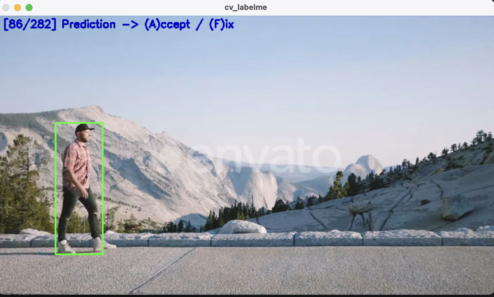
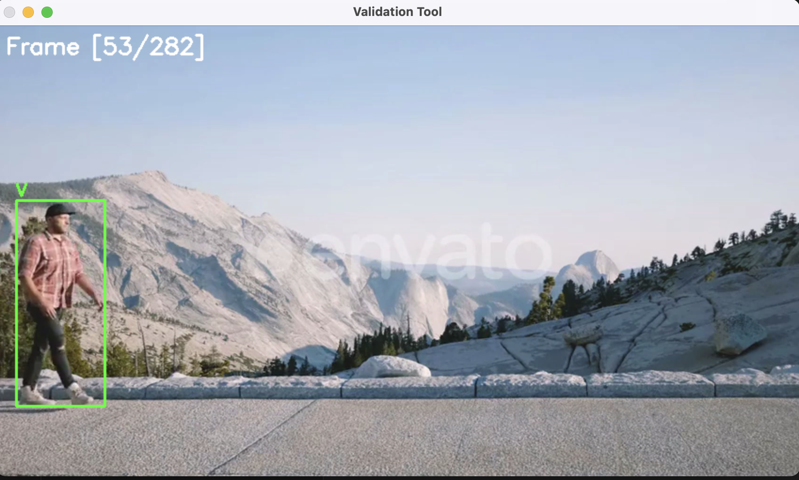

# ClipCheck

CVLabelTool is an interactive video annotation tool for object detection. It supports both **prompt-based detection** (using a text prompt to detect objects) and **manual labeling**. The tool also integrates a tracker for propagating bounding boxes across frames to accelerate labeling.

---

## Features

- Manual bounding box drawing with mouse  
- Prompt-based detection using state-of-the-art models  
- Tracking of detected objects across frames  
- Save annotations in LabelMe-like format  
- Frame skipping and manual override  

---

## Requirements

Install dependencies:

```bash
python3 -m venv label
source label/bin/activate
pip install -r requirements.txt
```
---

## Setup

1. **Download YOLOv8n weights** from Ultralytics:

Or manually from [Ultralytics YOLOv8 releases](https://github.com/ultralytics/ultralytics/releases).

2. Ensure your video files are accessible.

3. Optional: set up a prompt-based detection model (Grounding DINO):

```bash
# Installed via pip
pip install transformers
```

---

## Usage

Run the labeling tool:

```bash
python label_video.py --video data/videoplayback_1.mp4 --out path/to/output/folder --prompt "a person wearing brown"
```


### Key Bindings

- **`A`**: Accept current prediction  
- **`F`**: Fallback to manual labeling (force mouse redraw)  
- **`L`**: Redraw or rerun prompt-based detection  
- **`S`**: Skip frame  
- **`Q`**: Quit  

### Notes

- If the prompt-based detection fails or the tracker is inaccurate, press **`F`** to manually label the frame.  
- Bounding boxes will be saved in LabelMe-like JSON format under the output folder.

---

---

## Workflow for Validation
---

## Validation Tool

The Validation Tool is a simpler CLI utility to visualize labeled bounding boxes and perform quality checks on your annotations.

### Features
- Opens the video alongside its annotation JSON file.  
- Overlays bounding boxes on frames.  
- Color coding:
  - **Green** for visible (`V`) boxes  
  - Frames marked **Skipped (`S`)** or **Invisible (`I`)** show a text label instead of a box  

### Navigation
- **`n`** → Next frame  
- **`N`** → Skip 10 frames forward  
- **`p`** → Previous frame  
- **`P`** → Skip 10 frames back  
- **`q`** → Quit  

### Usage
```bash
python validate_video_ann.py --video path/to/video.mp4 --annotations path/to/video.json



